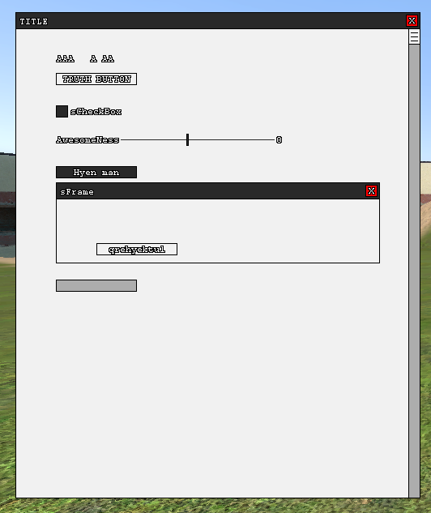

s0lame is a 100% surface and draw menu base, no vgui here. Although it does function similarly.\
Made for s0lum, hence the name.\
Wiki will come one day to aid you with using it, for now just read through the code and figure it out.

Current Element List

  
- sPanel
- sLabel
- sButton
- sFrame
- sCheckBox
- sSlider
- sLabelSlider
- sDropDown
- sScrollBar
- sTextBox

